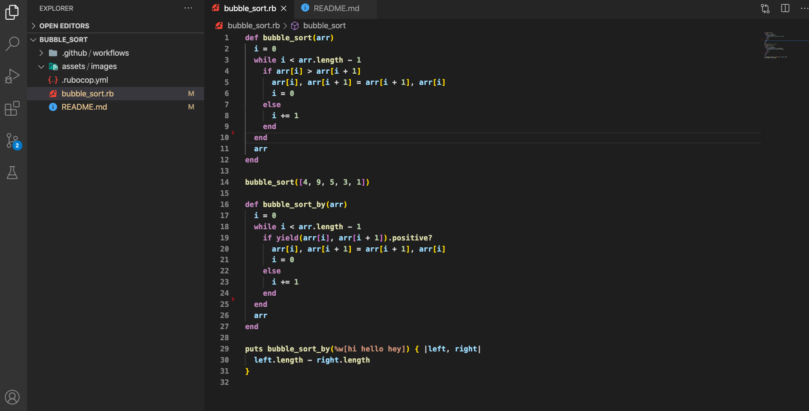

# Bubble Sort Algorithm

> This project was compiled by Amita and Ayo in the Ruby section of the Microverse course work. It involved using ruby to create a sorting method.

## Live Demo

See the project in action by visiting the [live demo](https://repl.it/@amita_r/Bubble-Sort#main.rb)!

## Built With

- Ruby
- VS Code
- Mac OS
- Windows
- Rubocop linter was used to check for style errors

## Getting Started

To get your own copy of our project simply clone the repository to your local machine.

> Step 1: Type the following command into a git shell

git clone https://github.com/Amita-Roy/bubble_sort_ruby

> Step 2: Direct a terminal into the cloned repository directory

cd bubble_sort

> Step 3: Run the program from command line, open it in irb, or edit it in a text editor

## Authors

👤 **Oyeleke Ayomide**

- Github: [@Haywhizzz](https://github.com/Haywhizzz)
- Twitter: [@Haywhizzz](https://twitter.com/Haywhizzz)
- Linkedin: [Haywhizzz](https://www.linkedin.com/in/oyeleke-ayomide-b962421a6/)

👤 **Amita Roy**

- Github: [@Amita-Roy](https://github.com/Amita-Roy)
- Twitter: [@AmitaRoy14](https://twitter.com/AmitaRoy14)
- Linkedin: [Amita Roy](https://www.linkedin.com/in/amita-roy-3b823b68/)

🤝 Contributing

Contributions, issues and feature requests are welcome!

Feel free to check the issues page.

Show your support
Give a ⭐️ if you like this project!

📝 License
This project is licensed by Microverse and the Odin Project
